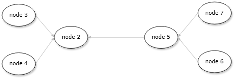
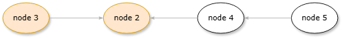
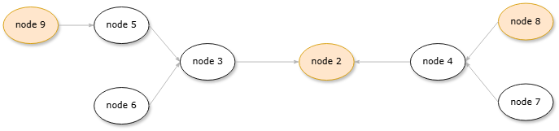

# test doc

## network creation test

**sequence:**
- 2 join network
- 3,4,5,7,6 join network
- send messages: 
    > 2->6 | 2->3 || 3->2 || 4->3 | 4->5 || 5->2 | 5->3 || 5->3 | 6->4

**start with:**
```
python testHelper.py ./test_py/netCreationTest.json <localIp>
```

## exit network
### test 1

**sequence:**
- 2 join network
- 3,4 join network
- 5 join network
- send messages: 
    > 2->3 |  2->5 || 3->4 || 4->2 || 5->2
- 3 leave network
- 2 leave network
- send messages: 
    > 4->5

**start with:**
```
python testHelper.py./test_py/testExit1.json <localIp>
```

### test 2

**sequence:**
- 2 join network
- 3,4 join network
- 5,6,7,9 join network
- send messages: 
    > 2->7 || 3->8 || 4->2 || 5->6 || 6->4 || 7->8 || 8->2 
- 8 leave network
- 9 join network
- send messages:
    > 2->9
- 2 leave network
- send messages:
    > 3->6 || 4->6 || 5->7 || 6->3 | 6->4 || 7->4 || 9->5 | 9->6 | 9->7
- 9 leave network

**start with:**
```
python testHelper.py./test_py/testExit2.json <localIp>
```